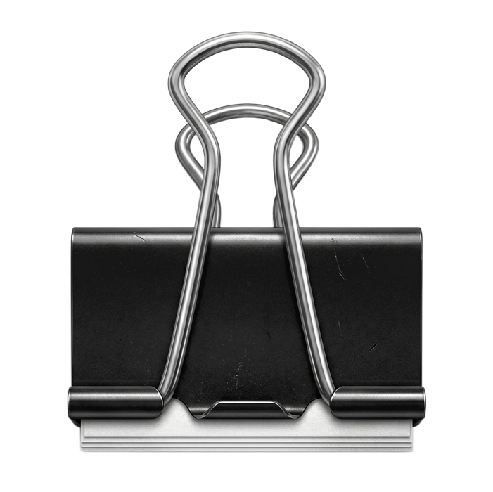
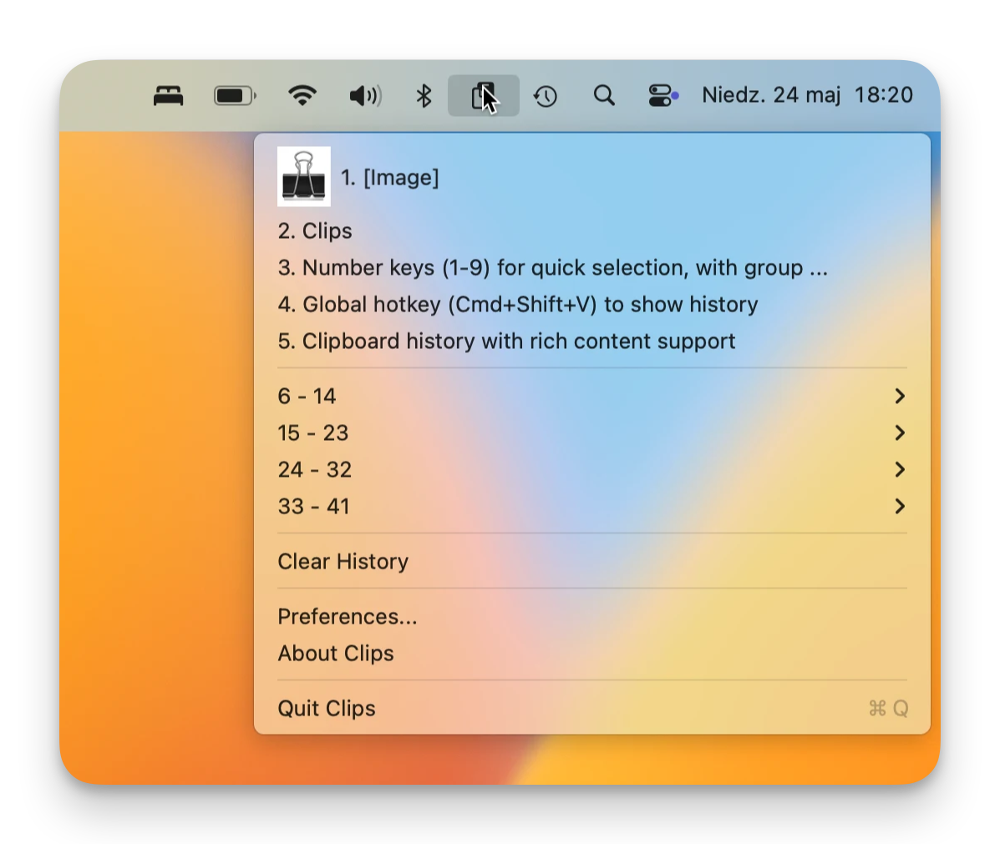
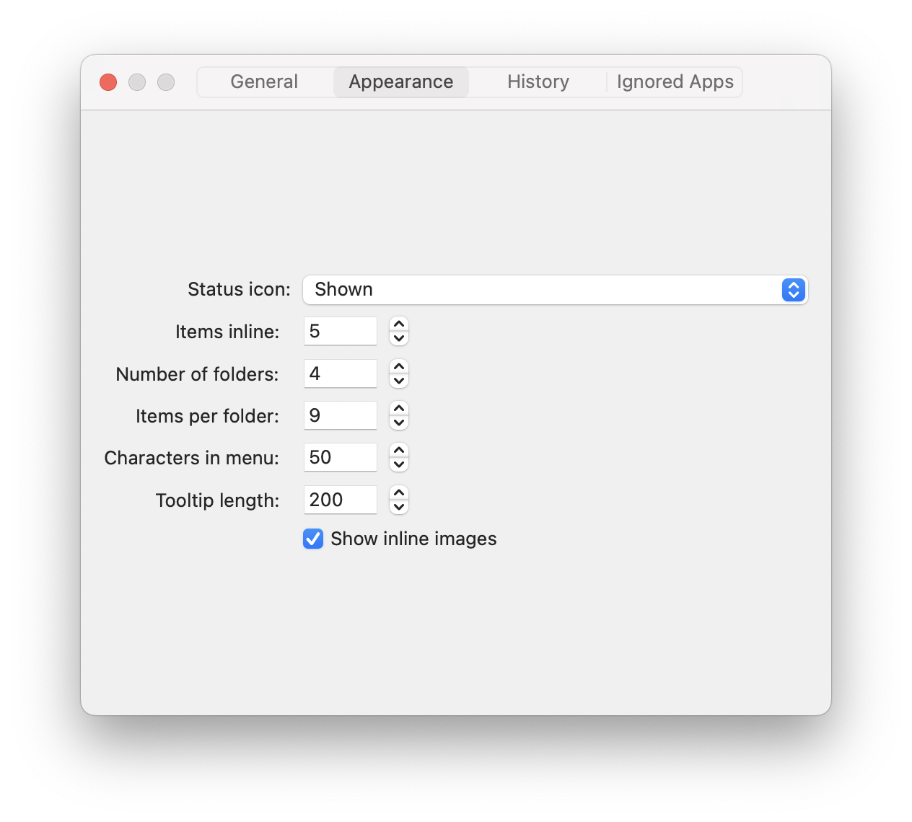

# Clips

  

<!-- Download button -->

  <a href="https://github.com/orestesgaolin/clips/releases/latest" target="_blank">
    Download latest release 
    
  </a>

  

A lightweight macOS clipboard manager that lives in your menu bar.

## Features

- Clipboard history with rich content support
- Global hotkey (Cmd+Shift+V) to show history
- Number keys (1-9) for quick selection, with group navigation

## Requirements

- macOS 15 (Sequoia) or later
- Accessibility permission (for paste simulation)

## Preferences

- **General** — launch at login, max history, sort order, paste shortcut
- **Appearance** — icon style, inline/group item counts, character limits, inline images
- **History** — search, copy, and delete entries
- **Ignored Apps** — exclude apps from clipboard monitoring

# Acknowledgements

App inspired by [Clipy](https://github.com/Clipy/Clipy).
